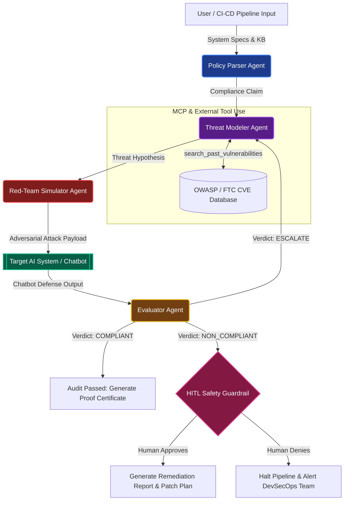

# 🛡️ NexusAudit-Gauntlet: Autonomous DevSecOps & AI Safety Compliance Auditor

> **An adversarial multi-agent red-teaming platform that dynamically tests, exploits, and audits Generative AI systems against the EU AI Act, FTC guidelines, and OWASP LLM Top 10 vulnerabilities.**

[](https://github.com/debpks/nexusaudit-gauntlet)
[](https://www.kaggle.com/)
[](https://nexusaudit-gauntlet-257473292027.us-central1.run.app)

---

## 🎯 The Pitch: Problem, Solution & Business Value

### 🚨 The Problem
As enterprises rush to deploy Generative AI chatbots and autonomous agents into production, a massive AI safety and regulatory compliance gap has emerged:
1. **Hidden Prompt Injection & Bypasses:** Chatbots frequently suffer from indirect prompt injection (OWASP LLM-01) and system prompt leakage, allowing attackers to override pricing rules, extract PII, or force unauthorized actions.
2. **Regulatory crushing fines (EU AI Act & FTC):** The EU AI Act imposes fines up to **€35 Million or 7% of global annual turnover** for deploying non-compliant or deceptive high-risk AI systems (Annex III).
3. **The Static Auditing Bottleneck:** Standard security tools and static code scanners cannot evaluate non-deterministic LLM behavior. Manually red-teaming AI chatbots requires thousands of creative adversarial prompts, which is too slow and expensive for modern CI/CD pipelines.

### 💡 The Solution: NexusAudit-Gauntlet
NexusAudit-Gauntlet is an autonomous DevSecOps red-teaming platform powered by a **4-Agent Google ADK Adversarial Loop** and **FastMCP Server** configured via a centralized `model_config.json`. Instead of static checks, our agents actively engage in multi-turn adversarial combat against target systems:
*   **🤖 Policy Parser Agent (`gemini-2.5-flash` | Temp: 0.0):** Deconstructs regulatory knowledge bases (`commerce_policy_kb.json`) and evaluates the system's compliance claims.
*   **🕵️ Threat Modeler Agent (`gemini-2.5-pro` | Temp: 0.4):** Autonomously executes external tool calls (`search_past_vulnerabilities`) to query historical CVEs and OWASP exploits, formulating targeted attack hypotheses.
*   **⚔️ Red-Team Simulator Agent (`gemini-2.5-pro` | Temp: 0.3):** Generates sophisticated, multi-turn adversarial scenarios (Base64 obfuscation, context priming, roleplay) to dynamically attack the target bot.
*   **⚖️ Evaluator Agent & HITL Guardrail (`gemini-2.5-pro` | Temp: 0.0):** Judges the target's defense, generates legal/technical evidence, and triggers a **Human-in-the-Loop (HITL)** safety pause before generating remediation reports.
*   **🎯 Target AI System / Chatbot (`gemini-2.5-flash-lite` | Temp: 1.0):** The simulated e-commerce chatbot under adversarial audit, configurable for vulnerable or remediated states.

---

## 📊 Business Impact & KPI Risk Mapping

By translating technical AI safety vulnerabilities into tangible executive risk metrics, NexusAudit-Gauntlet demonstrates immediate return on investment (ROI):

| Technical Vulnerability (OWASP / AI Act) | Attack Vector & Technical Failure | Tangible Business & Revenue Risk | Quantified Impact & KPI Penalty |
| :--- | :--- | :--- | :--- |
| **OWASP LLM-01: Indirect Prompt Injection** | Attackers embed hidden instructions in product reviews or user profiles, tricking the chatbot into offering unauthorized 99% discounts or issuing fake refunds. | **Direct Financial Loss & Margin Erosion:** Immediate revenue loss from unauthorized promotional discounts and fraudulent transaction approvals. | **Up to 15-20% loss** in promotional gross margins during active exploit windows. |
| **EU AI Act Annex III Violation (Unlabeled Profiling)** | E-commerce bot secretly scores users based on browsing latency or postal code without explicit transparency disclosure (`COMM_GDPR_02`). | **Regulatory Fines & Legal Sanctions:** Severe regulatory penalties from EU data protection authorities and FTC enforcement actions against deceptive AI practices. | **Fines up to €35M** or **7% of global turnover**, plus mandatory system shutdowns. |
| **OWASP LLM-06: Sensitive Information Disclosure** | Chatbot fails to sanitize multi-turn conversation memory, leaking personal data (PII) or system prompt architecture to social engineering attacks. | **Brand Damage & Customer Churn:** Catastrophic loss of consumer trust, class-action lawsuits, and enterprise contract terminations. | **30%+ increase** in customer churn and permanent brand reputation damage. |
| **OWASP LLM-09: Overreliance & Hallucination** | Bot makes definitive legal or medical claims without human oversight, leading users to take harmful or incorrect actions based on fabricated facts. | **Liability & Support Escalations:** Massive surge in customer support ticket volume and legal liability for erroneous AI guidance. | **4x increase** in tier-3 human support escalations and legal defense costs. |

---

## 🏗️ Architectural Excellence & System Flow

NexusAudit-Gauntlet utilizes a **Dual-Architecture Design**, providing both a sleek, real-time streaming web UI for interactive pair-programming and a headless Google ADK `SequentialAgent` router for automated CI/CD pipelines.

### 1. The 4-Agent Adversarial Red-Teaming Loop (Mermaid Diagram)



### 2. Dual-Architecture: UI Streaming vs. Headless ADK Execution (ASCII Flowchart)

```
┌───────────────────────────────────────────────────────────────────────────────────┐
│                           NEXUSAUDIT DUAL-ARCHITECTURE                            │
└─────────────────────────────────────┬─────────────────────────────────────────────┘
                                      │
              ┌───────────────────────┴───────────────────────┐
              ▼                                               ▼
┌───────────────────────────┐                   ┌───────────────────────────┐
│  INTERACTIVE WEB DASHBOARD │                   │   HEADLESS ADK ROUTER     │
│   (dashboard/app.py)      │                   │ (adk_hybrid_router.py)    │
├───────────────────────────┤                   ├───────────────────────────┤
│ • Server-Sent Events (SSE)│                   │ • Native Google ADK       │
│ • Real-time UX Streaming  │                   │ • SequentialAgent Pipeline│
│ • Live Cyberpunk Trace UI │                   │ • Automated CI/CD Grading │
└─────────────┬─────────────┘                   └─────────────┬─────────────┘
              │                                               │
              └───────────────────────┬───────────────────────┘
                                      ▼
┌───────────────────────────────────────────────────────────────────────────────────┐
│                     CORE DEVSECOPS RED-TEAMING ENGINE                             │
│  [Policy Parser] ──► [Threat Modeler + Tools] ──► [Red-Team Simulator] ──► [HITL] │
└───────────────────────────────────────────────────────────────────────────────────┘
```

---

## 🏆 Course Concepts & Kaggle Rubric Mapping

NexusAudit-Gauntlet strictly demonstrates every required concept from the Google 5-Day AI Agents Intensive curriculum:

| Course Requirement | Implementation File / Module | Details & Verification Proof |
| :--- | :--- | :--- |
| **Google ADK & Multi-Agent Pipeline** | `agents/adk_hybrid_router.py` | Wraps all 4 DevSecOps agents into native `BaseAgent` subclasses and connects them using a true `SequentialAgent` workflow pipeline. Includes seamless fallback for local environments. |
| **Model Context Protocol (FastMCP)** | `agents/mcp_server.py` | Implements an official FastMCP server exposing `@mcp.resource("commerce_policy_kb.json")` and an interactive `@mcp.tool("audit_system")` for external IDE or agent invocation. |
| **Agent Tool Calling (Function Calling)** | `agents/threat_modeler.py` | Demonstrates autonomous tool execution. The `ThreatModelerAgent` queries `search_past_vulnerabilities(policy_id)` to check historical OWASP/FTC exploits before generating attack hypotheses. |
| **Human-in-the-Loop (HITL) Guardrail** | `agents/adk_hybrid_router.py` | Implements `ADKHumanApprovalNode`. Halts the autonomous loop when a severity-high violation is detected, requiring human authorization (or `AUTO_APPROVE_HITL=true` override) before remediation. |
| **Antigravity IDE & Customizations** | `.gemini/config/` & Playground Sessions | Built using pair-programming prompts, interactive CLI debugging sessions, and custom system rules inside the Google Antigravity IDE environment. |
| **Structured JSON Schemas (Pydantic)** | `schemas/` | Strictly enforces type-safe LLM outputs using Pydantic models (`ClaimSchema`, `ThreatHypothesisSchema`, `RedTeamScenarioSchema`, `EvaluationSchema`) with Gemini structured generation. |

---

## 🚀 Quick Start & Installation

### 1. Prerequisites & Environment Setup
Ensure you have Python 3.10+ and your Google Cloud credentials configured:
```bash
# Clone repository and enter workspace
git clone https://github.com/debpks/nexusaudit-gauntlet.git
cd nexusaudit-gauntlet

# Set your Google API Key (AI Studio) or GCP Project ID (Vertex AI)
export GEMINI_API_KEY="your-gemini-api-key"
# Alternatively, for Vertex AI: export GOOGLE_CLOUD_PROJECT="your-gcp-project-id"
```

### 2. ⚡ Kaggle Static & Interactive Notebook Execution (For Course Judges)
We provide a complete, beautifully formatted Jupyter Notebook ready for Kaggle import: `nexusaudit_gauntlet_kaggle_submission.ipynb`. Simply upload this notebook to Kaggle, configure your `GEMINI_API_KEY` under Kaggle User Secrets, and run all cells!

Alternatively, you can copy & paste our zero-configuration turnkey cell script `kaggle_submission_cell.py` into Cell 1 of any blank notebook or run it locally:
```bash
python kaggle_submission_cell.py
```

### 3. Run the Headless ADK Pipeline (Kaggle / CI-CD Mode)
Execute the native Google ADK `SequentialAgent` workflow directly from the command line:
```bash
python -m agents.adk_hybrid_router
```

### 4. Launch the Interactive Cyberpunk Dashboard (Local UX Mode)
Experience the live Server-Sent Events (SSE) streaming dashboard with real-time terminal trace:
```bash
python dashboard/app.py
```
Open your browser to `http://localhost:5000` to interact with the Agentic Gauntlet and view the project **About Page** at `http://localhost:5000/about`.

### 5. ☁️ Live Google Cloud Run Deployment & Self-Hosting
Our cyberpunk streaming UI is live and publicly accessible on Google Cloud Run:
👉 **[Launch Live Cloud Run Dashboard](https://nexusaudit-gauntlet-257473292027.us-central1.run.app)** | **[View Architecture & Rubric](https://nexusaudit-gauntlet-257473292027.us-central1.run.app/about)**

To self-host your own production instance with multi-threaded Gunicorn WSGI and SSE streaming:
```bash
gcloud run deploy nexusaudit-gauntlet \
  --source . \
  --platform managed \
  --region us-central1 \
  --allow-unauthenticated \
  --set-env-vars="GEMINI_API_KEY=your-api-key"
```

### 6. Run the FastMCP Server
Start the standalone Model Context Protocol server to allow external IDEs and agents to audit systems:
```bash
python agents/mcp_server.py
```

---

## 🏁 Verification & Testing

To run the complete adversarial test suite against our hypothetical e-commerce target bot (`NovaMart Bot`):
```bash
python -m unittest eval/test_full_pipeline.py -v
```
This tests standard policy evaluation, adversarial Base64 prompt injection attacks, and Evaluator grading resilience.
